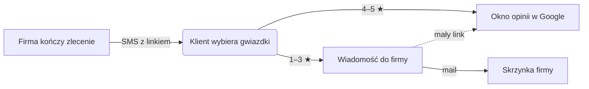

<p align="center">
  
</p>

<h1 align="center">Link do opinii</h1>

<p align="center">
  Jeden link dla wszystkich klientów. Zadowoleni trafiają prosto do opinii w Google,<br />
  a uwagi przychodzą najpierw do firmy.<br />
  <b>Za darmo, bez konta, bez abonamentu.</b> Narzędzie Design House.
</p>

<p align="center">
  <a href="https://dh-opinie.maciej-36d.workers.dev"><b>dh-opinie.maciej-36d.workers.dev</b></a>
  &nbsp;·&nbsp; Cloudflare Workers + D1 &nbsp;·&nbsp; bez frameworka, bez builda
</p>

---

## Jak to działa

Firma (np. ekipa remontowa MIREC) kończy zlecenie i wysyła klientowi link SMS-em. Klient widzi pięć gwiazdek:



- **4–5 gwiazdek:** przycisk otwiera okno opinii w Google w nowej karcie, a na stronie zostaje podziękowanie z prośbą o zaznaczenie gwiazdek także w Google.
- **1–3 gwiazdki:** pole na wiadomość, którą wysyłamy firmie mailem i której nie zapisujemy. Firma może zamiast tego wskazać formularz na swojej stronie. Pod spodem jest mały link do publicznej opinii w Google (wyjaśnienie niżej, w sekcji „Do decyzji”).

## Dla firmy

| Krok | Co się dzieje |
|---|---|
| **Firma** | nazwa i link z „Poproś o opinie” w Profilu Firmy Google, sprawdzany na żywo |
| **Uwagi** | gdzie mają trafiać wiadomości przy 1–3 gwiazdkach: na e-mail albo na stronę firmy |
| **E-mail** | 6-cyfrowy kod z maila zamiast konta i hasła |
| **Panel** | link z przyciskami Kopiuj i Udostępnij, gotowa wiadomość SMS, statystyki z 7 dni, oferta automatycznej wysyłki |

Jeden adres e-mail = jeden stały link (np. `/o/k3x9ab`). Zmiana danych nie zmienia adresu, więc wysłane wcześniej linki dalej działają. Na desktopie obok formularza jest telefon z podglądem na żywo, a na telefonie podgląd otwiera się przyciskiem z okiem.

## Uruchomienie lokalne

```bash
npm install
cp .dev.vars.example .dev.vars   # DEV_SHOW_CODE=1: kod z maila pokazuje się na stronie
npm run db:local                 # migracje D1 (lokalny SQLite w .wrangler/)
npm run db:seed                  # przykładowe linki: /o/demo123 i /o/demourl
npm run dev                      # http://localhost:8790
```

Maile lokalnie są tylko symulowane. Wrangler wypisuje w konsoli ścieżkę do pliku z treścią.

## Wdrożenie

```bash
npm run deploy                                        # wrangler deploy
npx wrangler d1 migrations apply dh-opinie --remote   # po każdej nowej migracji
```

Na koncie są już: Worker `dh-opinie`, baza D1 `dh-opinie` (region EEUR) i sekret `HASH_PEPPER`.

## Jak to jest zbudowane

| Plik | Co robi |
|---|---|
| [`src/worker.js`](src/worker.js) | API `/api/*` i strona oceny `/o/:id` (szablon i dane przez HTMLRewriter) |
| [`migrations/0001_init.sql`](migrations/0001_init.sql) | tabele `links`, `codes`, `sessions`, `events` |
| [`public/index.html`](public/index.html), [`assets/app.js`](public/assets/app.js) | generator i panel firmy |
| [`public/ocena.html`](public/ocena.html), [`assets/ocena.js`](public/assets/ocena.js) | strona dla klienta; `?podglad=1` to podgląd w generatorze |
| [`public/assets/links.js`](public/assets/links.js) | walidacja linków, wspólna dla Workera i przeglądarki |
| [`public/assets/base.css`](public/assets/base.css) | tokeny i komponenty: pomarańczowa pigułka z ikoną, ciemny pasek kroków, karty |

API:

| Metoda i adres | Opis |
|---|---|
| `POST /api/code` | wysyła 6-cyfrowy kod na e-mail |
| `POST /api/verify` | sprawdza kod i zwraca token sesji (7 dni) oraz link, jeśli istnieje |
| `GET /api/link` · `PUT /api/link` | odczyt i zapis linku firmy (sesja), zapis tworzy albo aktualizuje link |
| `POST /api/o/:id/event` | statystyki: `view`, `rate`, `google` |
| `POST /api/o/:id/feedback` | wiadomość od klienta, wysyłana mailem do firmy |

## Zabezpieczenia

- **Tylko Google:** strona oceny przekierowuje wyłącznie do domen Google. Link jest sprawdzany przy zapisie i jeszcze raz przy każdym wyświetleniu. Na stronę firmy nie przekierowujemy automatycznie: klient widzi przycisk z adresem.
- **Kody:** 6 cyfr, ważne 15 minut, najwyżej 5 prób, w bazie tylko hash. Wysyłka: 3 kody na godzinę na adres e-mail i 10 na IP.
- **Uwagi od klientów:** najwyżej 3 na godzinę z jednego IP na link i 40 na dobę na link. Formularz ma ukryte pole na boty, a Turnstile włącza się po ustawieniu kluczy.
- **Nazwa firmy w szablonie:** tekst escapuje HTMLRewriter, a w JSON każdy `<` jest zamieniany na `<`.
- **Prywatność:** treści uwag nie zapisujemy, a adresy IP trzymamy tylko jako hash.

## Grafiki

Ilustracje generuje Codex (`codex exec` z obrazem referencyjnym), wszystkie w jednym stylu: czarna kreska, czarne wypełnienia, pomarańczowe akcenty, przezroczyste tło. Zlecenia dla Codexa leżą w [`design/codex-*.md`](design/), źródła PNG w [`design/zrodla/`](design/zrodla/), a gotowe pliki WebP w [`public/img/`](public/img/).

<!-- GRAFIKI -->

## Przed startem na produkcji

1. **Domena:** subdomena (np. `opinie.designhouse.me`) albo osobna krótka domena, która daje krótsze linki i oddziela reputację od designhouse.me. Ustawić `PUBLIC_ORIGIN` i dodać trasę w `wrangler.jsonc`.
2. **Turnstile:** założyć widżet, potem `TURNSTILE_SECRET` (sekret) i `TURNSTILE_SITE_KEY` (zmienna).
3. **Maile:** sprawdzić na prawdziwym adresie spoza designhouse.me, że kod dochodzi. Nadawca jest ustawiony w `MAIL_FROM`.
4. **Fonty:** Urbanist ładuje się dziś z Google Fonts, także na stronie dla klientów firm. Pod RODO lepiej trzymać go u siebie (licencja OFL).
5. **Sprzątanie:** wygasłe sesje usuwa logowanie, ale stare `codes` i `events` warto czyścić cronem.
6. **Nagłówki:** przy dodawaniu `_headers` zostawić `frame-ancestors 'self'`, bo inaczej podgląd w ramce telefonu przestanie działać.
7. **`DEV_SHOW_CODE`:** tylko w `.dev.vars`, nigdy na produkcji.

Statystyki liczą dni jako kolejne 24 godziny wstecz od teraz, a nie dni kalendarzowe.

## Do decyzji

**Mały link do Google przy 1–3 gwiazdkach.** Pierwotny pomysł zakładał, że niezadowolony klient w ogóle nie widzi Google. Regulamin Google Business Profile zabrania jednak zniechęcania do negatywnych opinii i proszenia o opinie tylko zadowolonych klientów. Grozi to usunięciem opinii z profilu firmy. Dlatego link jest, tylko mniejszy. Usunięcie to jeden element z atrybutem `data-soft-gate` w [`public/ocena.html`](public/ocena.html).
